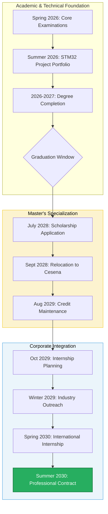

# The Corporate Pipeline: Master Plan V7

Status: Executing
Date: May 2026
Agent: Andrea d'Amico (20yo L-8 Engineering Student, UniCT)
Origin: Giarre, Sicily (ISEE < 5,000 EUR)
Destination: Northern Europe (Finland / Netherlands / Scandinavia)
Role: Embedded Systems / Edge AI Engineer (LM-32)

## 1. Executive Summary

The objective of this roadmap is to secure a high-value engineering role in the European hardware and embedded systems market. This is achieved by leveraging regional financial support (ER.GO), focusing on a specialized technical portfolio, and utilizing European mobility programs to transition directly into international corporate environments.

## 2. Financial Strategy (ER.GO Support)

Given the eligibility for full financial aid, the Master's degree will be pursued at the University of Bologna (Cesena Campus) to maximize state support and minimize cost of living.

### 2.1 The Cesena Advantage

The LM-32 Intelligent Embedded Systems program is located in Cesena. The city offers a high quality of life with manageable living expenses that can be fully covered by the regional scholarship.

### 2.2 Scholarship Logistics

The ER.GO scholarship for out-of-town students provides:

- Full tuition exemption.
- An annual grant of approximately 8,130 EUR.
- Access to university housing or a rental subsidy.

### 2.3 Eligibility Requirements

Maintenance of the scholarship for the second year requires passing a specific number of university credits (CFUs) by August 10th of the first academic year.

## 3. Academic Strategy (UniCT L-8)

The current objective is to complete the Bachelor's degree while maintaining a strong foundation in core computer engineering subjects.

### 3.1 Course Categorization

Courses are prioritized based on their relevance to the long-term professional goal:

**Priority 1: Core Technical Foundation**

- Computer Architecture
- Operating Systems
- Programming (C/C++)
- Object-Oriented Programming

**Priority 2: Supporting Engineering Subjects**

- Electronics
- Computer Networks
- Algorithms and Data Structures
- Electrical Engineering

**Priority 3: High-Level Concepts**

- Databases
- Software Engineering
- Security
- Automatic Control
- Machine Learning

**Priority 4: General Engineering Requirements**

- Mathematics (Analysis, Geometry)
- Physics
- Signal Theory
  _Strategy: Prioritize completion and credit acquisition over exhaustive mastery in this category._

## 4. Technical Portfolio (Embedded Systems)

To differentiate in the labor market, a technical portfolio focused on the hardware-software interface is required.

### 4.1 Summer 2026 Project

Development of a documented GitHub repository for an STM32-based system.

- **Hardware**: STM32 Nucleo board and I2C/SPI sensors.
- **Software**: Bare-metal C++ using STM32CubeIDE.
- **Architecture**: Implementation of FreeRTOS for task management, sensor data processing, and error handling.

## 5. Career Integration (International Mobility)

### 5.1 Erasmus+ for Traineeship

During the second year of the Master's program, the Erasmus+ program will be used to fund a 6-month internship abroad.

### 5.2 Target Regions

The internship search will focus on European hardware hubs:

- Finland (Tampere/Espoo): Telecommunications and electronics.
- The Netherlands (Eindhoven): Semiconductor industry.
- Denmark (Odense): Robotics and automation.

### 5.3 Goal

Transition the Master's thesis internship into a full-time professional contract upon graduation.

## 6. Roadmap Timeline

- **Spring 2026**: Complete remaining core examinations.
- **August - Sept 2026**: Develop and document the STM32 portfolio project.
- **2026 - 2027**: Complete final year of Bachelor's degree and thesis.
- **July 2028**: Apply for ER.GO scholarship and Master's enrollment.
- **September 2028**: Relocate to Cesena for Master's program.
- **August 2029**: Secure credits for scholarship renewal.
- **October 2029**: Apply for international internship funding.
- **Spring 2030**: Begin international internship for Master's thesis.
- **Summer 2030**: Complete degree and begin professional career.
