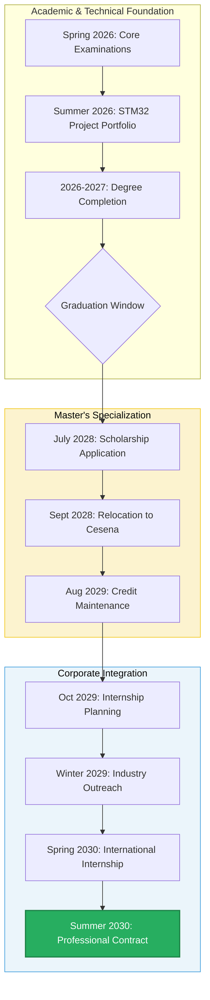

# The Corporate Pipeline: Master Plan V7

Status: Executing
Date: May 2026
Agent: Andrea d'Amico (20yo L-8 Engineering Student, UniCT)
Origin: Giarre, Sicily (ISEE < 5,000 EUR)
Destination: Northern Europe (Finland / Netherlands / Scandinavia)
Role: Embedded Systems / Edge AI Engineer (LM-32)

## 1. Executive Summary

This roadmap outlines the strategy to secure a high-value engineering role in the European hardware market. By leveraging regional financial support (ER.GO), building a specialized technical portfolio, and utilizing Erasmus+ mobility, the goal is to transition from a Bachelor's in Sicily to a professional career in Northern Europe.

## 2. Strategic Specialization Tracks

The 2026 market mandates a pivot away from generalist engineering toward high-barrier niches:

- **Track A: The "Sovereign Silicon" Architect**: Focus on RISC-V and custom hardware accelerators. Ideal for the German automotive sector (ISO 26262 compliance).
- **Track B: The "Memory-Safe" DevSecOps Expert**: Focus on Rust and cyber-resilience (CRA compliance). Target for secure industrial and consumer systems.
- **Track C: The "MedTech" Intelligence Specialist**: Focus on connected healthcare and agentic AI in surgery. High-value target for the Swiss pharma/tech sector.
- **Track D: The "Dexter of Silicon" (Hardware Forensics & Cyber-Intel)**: Focus on physical reverse engineering, chip-off forensics, JTAG boundary scans, and side-channel analysis. Targeted at private security consulting, Europol, or national law enforcement agencies.

## 3. Detailed Sections

- [Academic Strategy](file:///c:/Users/Andrea/Desktop/projects/professional/master-plan/01_Academic/academic_strategy.md)
- [Technical Portfolio](file:///c:/Users/Andrea/Desktop/projects/professional/master-plan/02_Technical_Projects/technical_portfolio.md)
- [Financial Logistics](file:///c:/Users/Andrea/Desktop/projects/professional/master-plan/03_Financial_Logistics/financial_strategy.md)
- [Market Analysis](file:///c:/Users/Andrea/Desktop/projects/professional/master-plan/04_Career_Development/market_analysis.md)
- [Career Integration](file:///c:/Users/Andrea/Desktop/projects/professional/master-plan/04_Career_Development/career_integration.md)
- [Roadmap Timeline](file:///c:/Users/Andrea/Desktop/projects/professional/master-plan/00_Strategy/roadmap_timeline.md)
