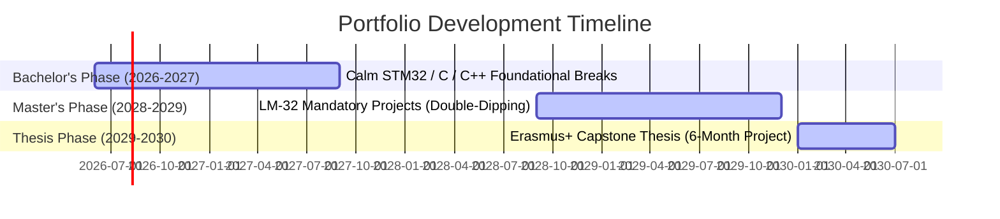

# 4. Technical Portfolio & "Double-Dipping" Strategy

To optimize cognitive load, eliminate study distractions, and maintain absolute focus on academic excellence, the portfolio strategy is streamlined. Instead of building dozens of scattered side projects or rushing under a stressful deadline, development is consolidated into a **Slow-Burn** approach during the Bachelor's breaks, followed by the **Double-Dipping** weaponization of LM-32 university coursework.

---

## 4.1 The Strategic Portfolio Roadmap

### 1. Bachelor's Phase (2026-2027): Slow-Burn Foundations (STM32 Nucleo)
*   **Goal**: Build foundational STM32 / C / C++ projects calmly during university breaks. Since the November 2026 EIT deadline is gone, this is **no longer an emergency**.
*   **Scope**: A *Sensor Anomaly Monitor* (real-time data acquisition and inference) handling real-world physical constraints:
    *   **Hardware**: STM32 Nucleo board, IMU sensor connected via $I^2C$.
    *   **Software**: Bare-metal C/C++, HAL/LL drivers, and FreeRTOS.
    *   **Constraints**: Managing physical scarcity (strict limits on RAM/Flash, optimized power consumption/low-power modes, RTOS determinism).
    *   **Deliverables**: A single, immaculate GitHub repository featuring production-grade code, detailed circuit schematics, performance benchmarks (latency, memory footprint), and a professional `README.md`.
    *   **Pacing**: Developed calmly during summer and winter breaks, fully keeping the focus during the semesters on passing the L-8 core exams.

### 2. Master's Phase (2028-2029): The Primary "Double-Dipping" Engine
*   **Goal**: Eliminate the pressure to build separate "side projects" that compete with study time.
*   **Execution**:
    *   **Primary Portfolio Generation**: Will happen during the LM-32 via mandatory university projects. For exams like *Embedded Systems and IoT*, *Distributed Systems*, and *Cybersecurity*, write exceptionally clean, professional code.
    *   Format these academic projects with commercial-grade `README.md` files, architectural diagrams, hardware schematics, and unit tests.
    *   Push them directly to GitHub as showcase pieces. This transforms study hours into direct portfolio assets without extra overhead.

### 3. Thesis Phase (2029-2030): The 6-Month Capstone Portfolio
*   **Goal**: Secure a prestigious 6-month Master's thesis abroad (via Erasmus+ Traineeship) at a major Northern European company or research institute (e.g., NXP, ASML, Nokia, Volvo, Ericsson) in the Netherlands, Sweden, or Germany.
*   **Execution**: The thesis itself will serve as the ultimate professional capstone project. By solving a real-world, high-impact industry problem, it acts as a direct bridge into a full-time professional contract upon graduation, rendering separate personal projects obsolete.

---

## 4.2 Core Project Specification: Sensor Anomaly Monitor (Pre-November 2026)

**Base**: STM32 Nucleo · C/C++ · FreeRTOS
**Sensor**: IMU (I2C) — Accelerometer + Gyroscope stream
**Analysis**: Statistical anomaly detection & optimized thresholding
**FreeRTOS Task Architecture**:
- `task_acquire`: Poll sensor at fixed rate via $I^2C$.
- `task_process`: Compute rolling statistics and handle signal filtering.
- `task_output`: UART telemetry logging + GPIO LED alarm trigger.

**Scarcity Management**:
- **Static Memory**: No dynamic allocation (`malloc` banned) to prevent heap fragmentation.
- **Power Optimization**: Place processor in Sleep/Stop mode between RTOS ticks to maximize battery life.
- **Real-Time Determinism**: Strict task priorities to ensure zero missed samples.

---

## 4.3 Philosophical Pivot: AI-Proofing (Architecture vs. Syntax)

> [!TIP]
> ### 🧠 AI-Proofing: Architecture vs. Syntax
> To eliminate future AI-anxiety, understand the fundamental boundary between AI capability and physical engineering:
> 
> *   **Software Syntax (AI Domain)**: AI is highly proficient at writing boilerplate code, general-purpose syntax, and standard driver logic. This is a commodity.
> *   **Embedded Architecture (Human Domain)**: The Embedded Engineer acts as the architect of physical scarcity. AI cannot probe a custom PCB with an oscilloscope, optimize for a hard 512KB RAM limit, guarantee microsecond-level RTOS determinism under battery-life constraints, or physically debug JTAG hardware lines.
> 
> **Actionable Focus**: Focus learning on **why** to use specific paradigms (e.g., Interrupts, Static Memory Pools, direct register mapping) for physical hardware, rather than just *how* to write the syntax. You are an architect of the physical world, not just a writer of code.

---

## 4.4 Technology Radar

| Technology | Priority | Rationale |
| :--------- | :------- | :-------- |
| C/C++ (bare-metal + HAL) | ✅ Core | Hiring baseline for all embedded roles |
| FreeRTOS | ✅ Core | Baseline RTOS scheduling base for STM32 project |
| Embedded Linux (Buildroot) | 🔴 High | Required for systems-level roles (NXP, Nokia) in Master's |
| TFLite Micro / ONNX Runtime | 🔴 High | Edge AI differentiator — thread constant |
| Rust (embedded) | 🔴 High | Memory safety + CRA compliance (50% production jump) |
| RISC-V | 🔴 High | Open hardware; target for "Sovereign Silicon" track |
| CAN bus / ISO 11898 | 🟡 Medium | Automotive — bridges IDS research to portfolio |
| Zephyr RTOS | 🟡 Medium | Growing adoption; modern RTOS standard |
| Docker / CI (GitHub Actions) | ✅ Core | Portfolio reproducibility and professional workflow |
| CRA Compliance | ✅ Core | Legal mandate for European connected devices |
