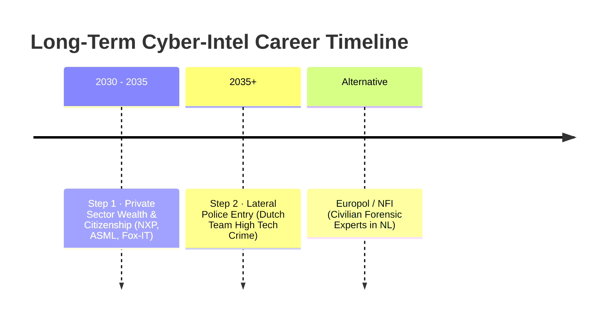

# 5. Career Integration (International Mobility & Long-Term Horizon)

## 5.1 Erasmus+ for Traineeship

During the second year of the Master's program, the Erasmus+ program will be used to fund a 6-month internship abroad.

## 5.2 Target Regions

The internship search will focus on European hardware hubs:

- **Finland (Tampere/Espoo)**: Telecommunications and electronics (Nokia, etc.).
- **The Netherlands (Eindhoven)**: Semiconductor industry (NXP, ASML, etc.).
- **Germany (Munich/Stuttgart)**: Automotive systems and Industry 4.0 (Bosch, etc.).

## 5.3 Goal

Transition the Master's thesis internship (acting as the ultimate 6-month capstone portfolio project) into a full-time professional contract upon graduation.

---

## 5.4 The Long-Term Career Horizon (2030+): Hardware Forensics & Cyber-Intel

Alongside the standard commercial Edge AI path, a new long-term sovereign path is established: the **Digital Detective / Hardware Forensics** specialist—informally designated as the **"Dexter of Silicon"**.

### 🔍 Role Definition: The "Dexter of Silicon"
This role transcends standard software security. It involves physical, low-level reverse engineering of hardware to extract data from compromised, encrypted, or physically destroyed devices.
*   **Tactical Focus**: Chip-off forensics (desoldering flash memory chips), JTAG boundary scan testing, side-channel analysis, and hardware-level reverse engineering on targets like military drones, cartel IoT black boxes, and modern connected vehicle ECUs.

### 🗺️ The 3-Step Masterstroke Timeline

#### Step 1 (2030-2035): Private Sector Wealth & Citizenship
*   **Actions**: Enter the Northern European private sector (ASML, NXP, Fox-IT, or similar high-caliber security firms).
*   **Strategic Goals**:
    *   Secure a high initial salary to build solid generational wealth and financial security.
    *   Establish stable family life in Northern Europe.
    *   Cross the 5-year residency mark to obtain EU / local citizenship, which is critical for future security clearances.

#### Step 2 (2035+): Lateral Entry into National Law Enforcement
*   **Actions**: Transition from the private sector into a national cyber-investigative unit (e.g., the Dutch *Team High Tech Crime*).
*   **Strategic Goals**:
    *   Enter as a sworn officer/digital detective.
    *   Don the tactical uniform and weaponize elite hardware reverse-engineering skills for high-level international justice.
    *   Achieve deep job satisfaction and sense of purpose, knowing the family is already financially secured from Step 1.

#### Alternative: Civilian Expert Roles
*   **Target Entities**: **Europol** (The Hague) or the **NFI** (Netherlands Forensic Institute) as civilian forensic experts/researchers.
*   **Strategic Goals**: Work on international investigations and digital forensics research without needing active police officer status.

---
See also: [Market Analysis](file:///c:/Users/Andrea/Desktop/projects/professional/market_analysis.md)
