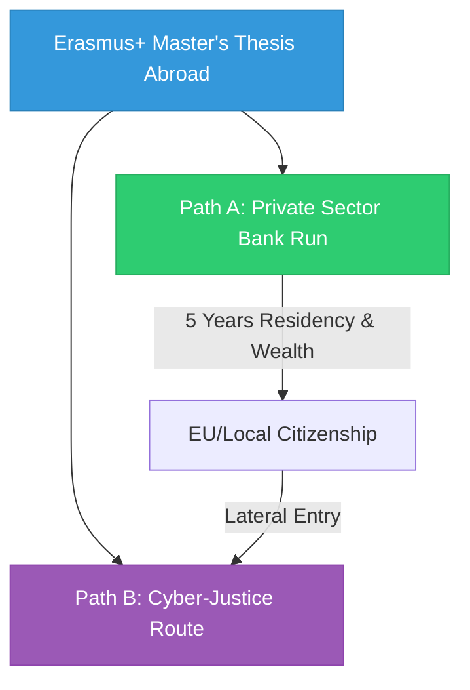

# 5. Career Integration (International Mobility & Long-Term Horizon)

## 5.1 Erasmus+ for Traineeship

During the second year of the Master's program, the Erasmus+ program will be used to fund a 6-month internship abroad.

## 5.2 Target Geographies & Bilateral Agreements

The international thesis search is strictly locked to UniBo's premier Erasmus+ bilateral agreements and academic networks within the designated target countries. All legacy references to EIT partner nodes (e.g., KTH, Twente, Berlin, and Finland) are officially removed.

### 🇳🇱 Netherlands (Primary Target Country)

- **TU Eindhoven (TU/e)**: Unlocks the private sector powerhouse in Eindhoven. Focuses on advanced semiconductor manufacturing, industrial firmware, and edge compute nodes.
  - _Primary Hubs_: ASML, NXP, Philips, and local high-tech scale-ups.
- **TU Delft (TUD)**: Unlocks the cyber-intel and security core in South Holland. Focuses on advanced distributed systems, cryptography, and secure embedded architecture.
  - _Primary Hubs_: Europol, Netherlands Forensic Institute (NFI), Fox-IT, and government security agencies.

### 🇸🇪 Sweden (Secondary Target Country)

- **Chalmers University of Technology (Gothenburg)**: Focuses on automotive embedded hardware, RTOS scheduling, and functional safety (ISO 26262 / AUTOSAR compliance).
  - _Primary Hubs_: Volvo Group, Volvo Cars, Ericsson, and automotive tech hubs.

### 🇩🇪 Germany (Tertiary Target Country)

- **TU Munich (TUM)**: Focuses on high-barrier industrial Edge AI, custom RISC-V acceleration, and Cyber Resilience Act (CRA) compliant firmware.
  - _Primary Hubs_: Bosch, Infineon, BMW, and industrial automation players.

---

## 5.3 The Erasmus+ Thesis: The Ultimate "Flexibility Engine"

The UniBo LM-32 -> Erasmus+ Thesis pipeline acts as an elite **"Flexibility Engine."** By completing a 6-month industry-led thesis internship abroad at TU Eindhoven, TU Delft, Chalmers, or TU Munich, we unlock **two distinct, highly lucrative post-graduation paths** without needing to choose between them today.

### Path A: The Private Sector

- **Goal**: Direct transition from the Master's thesis into a high-paying, full-time engineering role.
- **Targets**: ASML, NXP, Volvo, Ericsson, Bosch, or Infineon.
- **Financial Impact**: Transitioning directly from the thesis into a **€70k+ entry-level role**, building solid wealth, establishing a high-end local lifestyle, and crossing the **5-year residency mark** to secure local/EU citizenship.

### Path B: Cyber-Justice

- **Goal**: Apply advanced low-level embedded and hardware engineering skills directly to Digital Forensics and Cyber-Intelligence.
- **Direct Entry**: Transitioning into the **Netherlands Forensic Institute (NFI)**, **Europol** (as a civilian hardware expert), or similar secure research roles directly after the thesis.
- **Sovereign Law Enforcement Entry**: Completing the 5-year residency (funded by Path A) to obtain local citizenship and security clearances, then applying via **"Lateral Entry" to a National Police Cyber Unit** (e.g., Dutch _Team High Tech Crime_) as a sworn officer / Digital Detective (the "Dexter of Silicon").

---

See also: [Market Analysis](file:///c:/Users/Andrea/Desktop/projects/professional/master-plan/04_Career_Development/market_analysis.md) | [EIT Digital Postmortem](file:///c:/Users/Andrea/Desktop/projects/professional/master-plan/00_Strategy/EIT_Digital_Postmortem.md)
