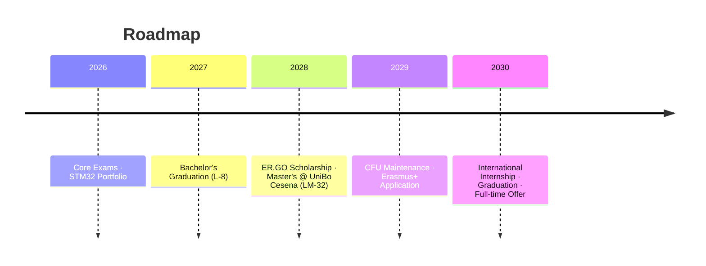

# Master Plan (V7)

> [!CAUTION]
> ## 🔴 MINDSET & SCOPE LOCK: THE EXECUTION PHASE
> **The planning phase is officially LOCKED. There will be no "V8".**
> The overarching 5-year plan is mathematically sound and verified. The time horizon must now shrink from "5 years" to **"the next 24 hours"**.
> The only acceptable tasks moving forward are passing the upcoming L-8 exams and writing code.

**Status:** Executing | **Target:** Embedded Systems / Edge AI Engineer in Northern Europe

## Structure

| Folder                                                 | Contents                              |
| ------------------------------------------------------ | ------------------------------------- |
| [`00_Strategy/`](./00_Strategy/)                       | Master plan, long-term objectives     |
| [`01_Academic/`](./01_Academic/)                       | Study plans, CFU tracking, exam notes |
| [`02_Technical_Projects/`](./02_Technical_Projects/)   | Hardware/software portfolio specs     |
| [`03_Financial_Logistics/`](./03_Financial_Logistics/) | ER.GO scholarship, ISEE, housing      |
| [`04_Career_Development/`](./04_Career_Development/)   | Internship search, industry research  |
| [`99_Archive/`](./99_Archive/)                         | Completed milestones, historical docs |
