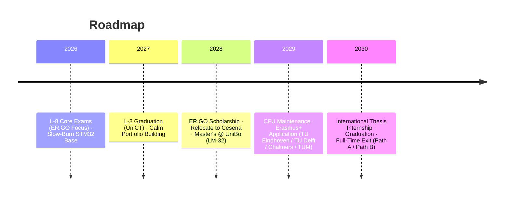

# Master Plan (V7) - Full UniBo Strategy Lock

**Status:** Executing | **Target:** Embedded Systems / Edge AI Engineer (Netherlands / Sweden / Germany)

## Vault Structure

| Folder                                                                                                                 | Contents                                                                                                                                                     |
| ---------------------------------------------------------------------------------------------------------------------- | ------------------------------------------------------------------------------------------------------------------------------------------------------------ |
| [`00_Strategy/`](file:///c:/Users/Andrea/Desktop/projects/professional/master-plan/00_Strategy/)                       | Master plan, long-term objectives, [EIT Postmortem](file:///c:/Users/Andrea/Desktop/projects/professional/master-plan/00_Strategy/EIT_Digital_Postmortem.md) |
| [`01_Academic/`](file:///c:/Users/Andrea/Desktop/projects/professional/master-plan/01_Academic/)                       | Study plans, CFU tracking, exam notes                                                                                                                        |
| [`02_Technical_Projects/`](file:///c:/Users/Andrea/Desktop/projects/professional/master-plan/02_Technical_Projects/)   | Hardware/software portfolio specs, "Slow-Burn" approach                                                                                                      |
| [`03_Financial_Logistics/`](file:///c:/Users/Andrea/Desktop/projects/professional/master-plan/03_Financial_Logistics/) | ER.GO scholarship, ISEE, housing (100% safety)                                                                                                               |
| [`04_Career_Development/`](file:///c:/Users/Andrea/Desktop/projects/professional/master-plan/04_Career_Development/)   | Career integration, target regions, dual-path exit strategy                                                                                                  |
| [`99_Archive/`](file:///c:/Users/Andrea/Desktop/projects/professional/master-plan/99_Archive/)                         | Completed milestones, historical docs                                                                                                                        |
